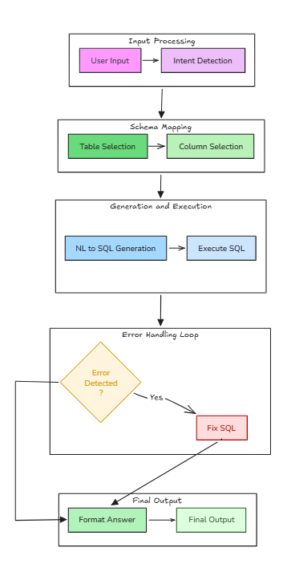
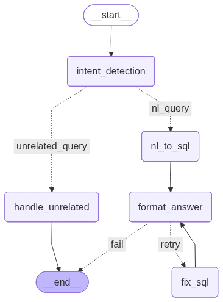

# Agentic SQL Generator using LangGraph

---

## Project Goal

The goal of this project is to build an agentic Natural Language to SQL system using LangGraph that can:

* Understand user intent from natural language queries
* Select relevant database tables and columns dynamically
* Determine correct join paths using a graph-based approach
* Generate valid and optimized SQLite SQL queries
* Execute the generated SQL against a live database
* Automatically fix SQL errors through a retry mechanism
* Return both the generated SQL query and its execution result

The system is designed to reduce hallucination by strictly enforcing schema awareness and deterministic join planning.

---

## Features

* Intent detection (Natural Language query, SQL explanation, unrelated query handling)
* Schema-aware table selection
* Schema-constrained column selection
* Graph-based join path discovery using BFS
* Deterministic join condition enforcement
* Structured LLM outputs using function calling
* Automatic SQL execution against SQLite
* Self-correcting retry loop for SQL errors
* Returns both generated SQL and query output
* Modular LangGraph state-driven workflow
* Clean separation of planning, execution, and formatting

---

## Folder Structure

```
AgenticSQLGenerator/
│
├── database.py
├── populate_enterprise_db.py
│
├── state.py
├── graph.py
│
├── tools.py
│
├── join_config.py
├── join_planner.py
|
├── nodes/
│   ├── table_selector.py
│   ├── column_selector.py
│
├── main.py
├── test.py
│
└── README.md
```

### File Responsibilities

* `database.py` – Creates SQLite schema and foreign key relationships
* `populate_enterprise_db.py` – Inserts sample enterprise data
* `state.py` – Defines LangGraph shared state
* `graph.py` – Defines the LangGraph workflow and transitions
* `tools.py` – Contains core agent nodes (intent, SQL generation, execution, retry, formatting)
* `nodes/` – Modular table and column selection logic
* `main.py` – Entry point to run the agent interactively
* `test.py` – Used for isolated testing

---

## Tech Stack

* Python 3.10+
* LangChain
* LangGraph
* OpenAI (or compatible LLM with structured output support)
* SQLite
* Pydantic
* TypedDict-based state management

---

## Architecture

This project follows an agentic graph-based architecture instead of a linear pipeline.

Each component is implemented as a node in a LangGraph workflow. The system maintains a shared state object that is updated and passed between nodes.

### Core Architectural Principles

1. State-Driven Design
   A central state object tracks user input, selected tables, selected columns, generated SQL, execution results, retry count, and final answer.

2. Deterministic Planning
   Join relationships are not left to the LLM. Instead:

   * Foreign key metadata is extracted
   * A join graph is constructed
   * BFS is used to compute shortest join paths
   * Only valid joins are injected into the SQL generation prompt

3. Structured Outputs
   LLM outputs are constrained using structured schemas to prevent free-form hallucinated responses.

4. Self-Correcting Execution
   If SQL execution fails:

   * The error is captured
   * SQL is passed to a correction node
   * Query is retried up to a maximum retry limit

5. Clear Separation of Concerns

   * Planning (intent, table, column selection)
   * SQL generation
   * Execution
   * Error handling
   * Output formatting

---

## LangGraph Workflow

The system follows this execution flow:

1. Intent Detection
   Determines whether the input is:

   * Natural language query
   * SQL explanation request
   * Unrelated query

2. If Natural Language Query:

   * Table Selection
   * Column Selection
   * NL to SQL Generation
   * SQL Execution
   * Conditional Error Handling
   * Output Formatting

3. If SQL Query:

   * SQL to Natural Language explanation

4. If Unrelated:

   * Graceful fallback response

---

## Flow Diagram



---

## Workflow



---

## Future Improvements

* Add automatic LIMIT enforcement for large result sets
* Implement query result pagination
* Add execution time measurement and logging
* Introduce query caching for repeated requests
* Add cost-based join optimization
* Add conversational memory support
* Convert to FastAPI-based REST API
* Build a Streamlit or web-based UI
* Add authentication and role-based access control
* Add monitoring and structured logging
* Deploy using Docker with CI/CD pipeline
* Integrate semantic schema search using embeddings

---

If you would like, I can also provide:

* A short professional GitHub project description (2–3 lines)
* Resume bullet points for this project
* An interview-ready system design explanation
