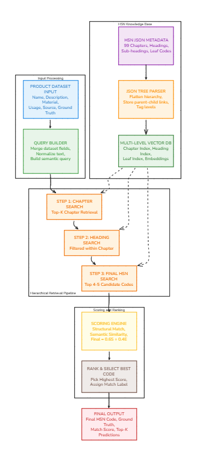

# CommodityCodeFinder

CommodityCodeFinder is an AI-powered HSN (Harmonized System of Nomenclature) classification system that predicts the most relevant 6-digit HSN code for a given product description.

The system combines:

* Semantic search using vector embeddings
* Metadata-based filtering
* Cross-encoder reranking
* Few-shot LLM reasoning for final HSN selection

The architecture is modular and production-ready, designed for scalable commodity classification using Azure OpenAI and Chroma vector database.

---

## Architecture Overview

The system follows a Retrieval-Augmented Generation (RAG) pipeline:

1. Flatten structured HSN chapter JSON files into subheading-level records.
2. Generate embeddings for each 6-digit HSN subheading.
3. Store embeddings in Chroma vector database.
4. Perform semantic retrieval for a given product query.
5. Rerank retrieved results using a cross-encoder.
6. Use an LLM to select the final top HSN codes.

You can insert your architecture diagram below:

---

# Flow Diagram



---

## Project Structure

```
COMMODITYCODEFINDER/
│
├── chroma_db/                # Persistent vector database
├── data/
│   ├── raw/                  # Raw chapter JSON files
│   └── ground_truth.xlsx     # Evaluation dataset
│
├── src/
│   ├── ingestion/
│   │   ├── flatten.py        # Converts JSON to flat subheading records
│   │   ├── ingest.py         # Batch ingestion into Chroma
│   │   └── vectordb.py       # Embedding + vector store setup
│   │
│   ├── retrieval/
│   │   ├── chapter_predictor.py  # Final LLM-based HSN selection
│   │   └── reranker.py           # Cross-encoder reranking
│   │
│   ├── config.py             # Environment configuration
│   └── main.py               # Entry point
│
└── .env                      # Azure OpenAI credentials
```

---

## Core Components

### 1. Data Flattening (`flatten.py`)

* Reads structured HSN chapter JSON files.
* Extracts:

  * Chapter
  * Heading (4-digit)
  * Subheading (6-digit)
* Generates clean text representations for embedding.
* Attaches structured metadata for filtering.

---

### 2. Vector Database (`vectordb.py`)

* Uses Azure OpenAI Embeddings.
* Stores embeddings in Chroma DB.
* Enables:

  * Similarity search
  * MMR retrieval
  * Metadata filtering

---

### 3. Ingestion Pipeline (`ingest.py`)

* Processes flattened records.
* Inserts embeddings in batches.
* Handles API rate limiting with retries.
* Persists data in `chroma_db`.

---

### 4. Semantic Retrieval

* Uses vector similarity search.
* Retrieves top-k candidate HSN subheadings.
* Filters results dynamically based on metadata.

---

### 5. Reranking (`reranker.py`)

* Uses `cross-encoder/ms-marco-MiniLM-L-6-v2`.
* Re-scores retrieved results using deep query-document interaction.
* Improves precision before final prediction.

---

### 6. Final HSN Selection (LLM)

* Uses Azure Chat OpenAI.
* Applies few-shot prompting.
* Selects top 3 most relevant 6-digit HSN codes.
* Returns confidence scores.

---

## Environment Variables

Create a `.env` file in the root directory:

```
OPENAI_API_ENDPOINT=your_azure_endpoint
OPENAI_API_KEY=your_api_key
OPENAI_API_VERSION=your_api_version
deployment=your_embedding_deployment
DEPLOYMENT_NAME=your_chat_deployment
```

---

## Data Ingestion

First create these folders
data/ -> add the raw chapters.json, ground_truth.csv
chroma_db/ -> your sqlite db connection


Before running predictions, ingest HSN data:

```bash
python src/ingestion/ingest.py
```

This will:

* Flatten JSON chapter files
* Generate embeddings
* Store them in Chroma DB

---

## Running the System

```bash
python src/main.py
```

You will be prompted:

```
Enter product description:
```

The system will output:

* Predicted HSN codes
* Confidence scores

---

## Design Decisions

* Chroma DB for lightweight persistent vector storage.
* Azure OpenAI embeddings for domain-aware semantic representation.
* Cross-encoder reranking to improve retrieval precision.
* Few-shot prompting for structured and controlled LLM output.
* Metadata-based filtering for scalability.

---

## Future Improvements

* Replace few-shot LLM with fine-tuned classifier.
* Add evaluation pipeline with accuracy metrics.
* Implement batch inference mode.
* Add API layer using FastAPI.
* Deploy with Docker for production usage.

---


